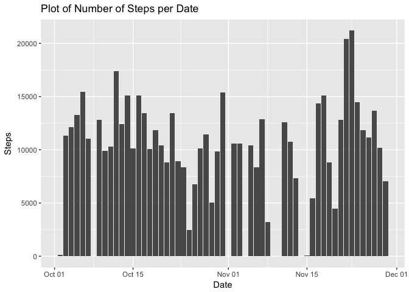
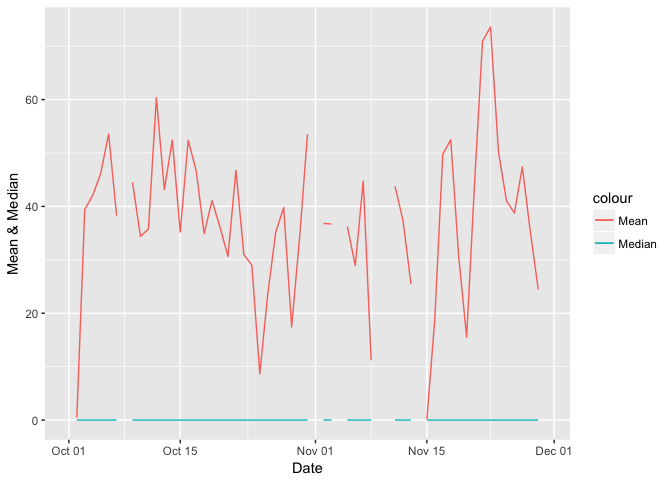
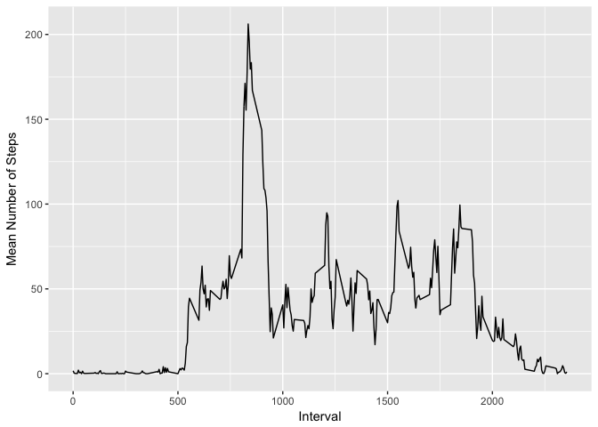
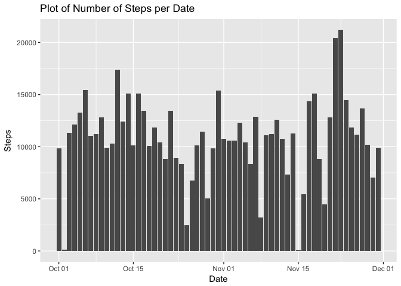
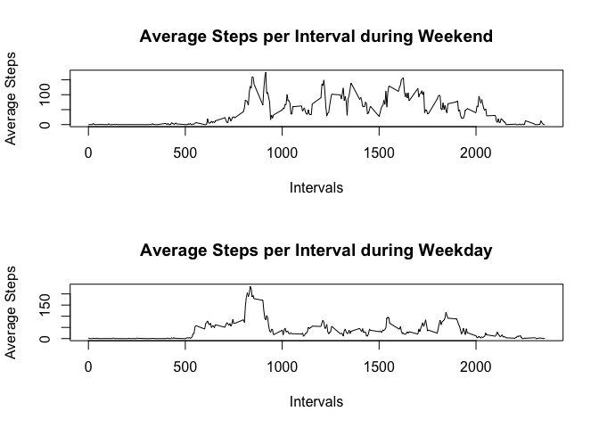

Part 1: Reading in the Data and loading Libraries
-------------------------------------------------

    library(dplyr)

    ## 
    ## Attaching package: 'dplyr'

    ## The following objects are masked from 'package:stats':
    ## 
    ##     filter, lag

    ## The following objects are masked from 'package:base':
    ## 
    ##     intersect, setdiff, setequal, union

    library(ggplot2)
    df<-tbl_df(read.csv("activity.csv"))
    df$date<-as.Date(df$date, format="%Y-%m-%d")
    df_filtered<-df[complete.cases(df$steps), ]

Part 2: Histogram of the total number of steps taken each day -
---------------------------------------------------------------

    knitr::opts_chunk$set(echo = TRUE)
    df_grouped<-group_by(df, by=date)
    df_summary <- summarize(df_grouped, Steps=sum(steps))
    print(ggplot(df_summary, aes(x=by, y=Steps))+geom_bar(stat="identity")+xlab("Date")+ggtitle("Plot of Number of Steps per Date"))

    ## Warning: Removed 8 rows containing missing values (position_stack).

Part 3: Mean and median number of steps taken each day
------------------------------------------------------

    df_mean_median <- summarize(df_grouped,Mean=mean(steps, na.rm = TRUE), Mdn=median(steps,na.rm = TRUE))
    print(ggplot(df_mean_median, aes(x=by, y=Mean))+geom_line(aes(y=Mean,color="Mean"))+geom_line(aes(y=df_mean_median$Mdn,color="Median"))+xlab("Date")+ylab("Mean & Median"))

    ## Warning: Removed 2 rows containing missing values (geom_path).

    ## Warning: Removed 2 rows containing missing values (geom_path).

Part 4: Time series plot of the average number of steps taken
-------------------------------------------------------------

    df_time <- df_filtered %>% group_by(by=interval) %>% summarize(Steps=mean(steps))
    print(ggplot(df_time, aes(x=by, y=Steps))+geom_line()+xlab("Interval")+ylab("Mean Number of Steps"))

Part 5: The 5-minute interval that, on average, contains the maximum number of steps
------------------------------------------------------------------------------------

    Max_steps<- df_time[which.max(df_time$Steps),1]

The 5-minute interval that, on average, contains the maximum number of
steps 835.

Part 6: Code to describe and show a strategy for imputing missing data
----------------------------------------------------------------------

Computing % of observations with missing steps

The percentage of observations with missing number of steps is
13.1147541%. We shall use the MICE package to impute the missing data

    library(mice)
    imputed_data <- mice(df[,c(1,3)], m=5)

    ## 
    ##  iter imp variable
    ##   1   1  steps
    ##   1   2  steps
    ##   1   3  steps
    ##   1   4  steps
    ##   1   5  steps
    ##   2   1  steps
    ##   2   2  steps
    ##   2   3  steps
    ##   2   4  steps
    ##   2   5  steps
    ##   3   1  steps
    ##   3   2  steps
    ##   3   3  steps
    ##   3   4  steps
    ##   3   5  steps
    ##   4   1  steps
    ##   4   2  steps
    ##   4   3  steps
    ##   4   4  steps
    ##   4   5  steps
    ##   5   1  steps
    ##   5   2  steps
    ##   5   3  steps
    ##   5   4  steps
    ##   5   5  steps

Using the 5th set of data of imputed data to complete data:

    completeData<-complete(imputed_data,5) #using the 5th set of imputed data
    completeData<-cbind(completeData,df$date)

Part 7: Histogram of the total number of steps taken each day after missing values are imputed
----------------------------------------------------------------------------------------------

    df_grouped <- group_by(completeData, by=df$date)
    df_summary <- summarize(df_grouped, Steps=sum(steps))
    print(ggplot(df_summary, aes(x=by, y=Steps))+geom_bar(stat="identity")+xlab("Date")+ggtitle("Plot of Number of Steps per Date"))

Part 8: Panel plot comparing the average number of steps taken per 5-minute interval across weekdays and weekends
-----------------------------------------------------------------------------------------------------------------

    weekdays1 <- c('Monday', 'Tuesday', 'Wednesday', 'Thursday', 'Friday')
    df_filtered$wDay <- factor((weekdays(df_filtered$date) %in% weekdays1), levels=c(FALSE, TRUE), labels=c('weekend','weekday'))

    df_wday_grouped<-df_filtered %>% group_by(interval, wDay) %>% summarise(Mn=mean(steps))
    yweekend<-df_wday_grouped$Mn[df_wday_grouped$wDay=="weekend"]
    yweekday<-df_wday_grouped$Mn[df_wday_grouped$wDay=="weekday"]

    intervals<-unique(df_wday_grouped$interval)
    p1<- ggplot(df_wday_grouped, aes(x=intervals, y=yweekend))+geom_line()

    yweekend<-df_wday_grouped$Mn[df_wday_grouped$wDay=="weekend"]
    yweekday<-df_wday_grouped$Mn[df_wday_grouped$wDay=="weekday"]

    par(mfrow=c(2,1))
    plot(intervals, yweekend, xlab="Intervals", type = "l",ps=2, ylab="Average Steps", main="Average Steps per Interval during Weekend")
    plot(intervals, yweekday, xlab="Intervals",type = "l", ps=2, ylab="Average Steps", main="Average Steps per Interval during Weekday")

